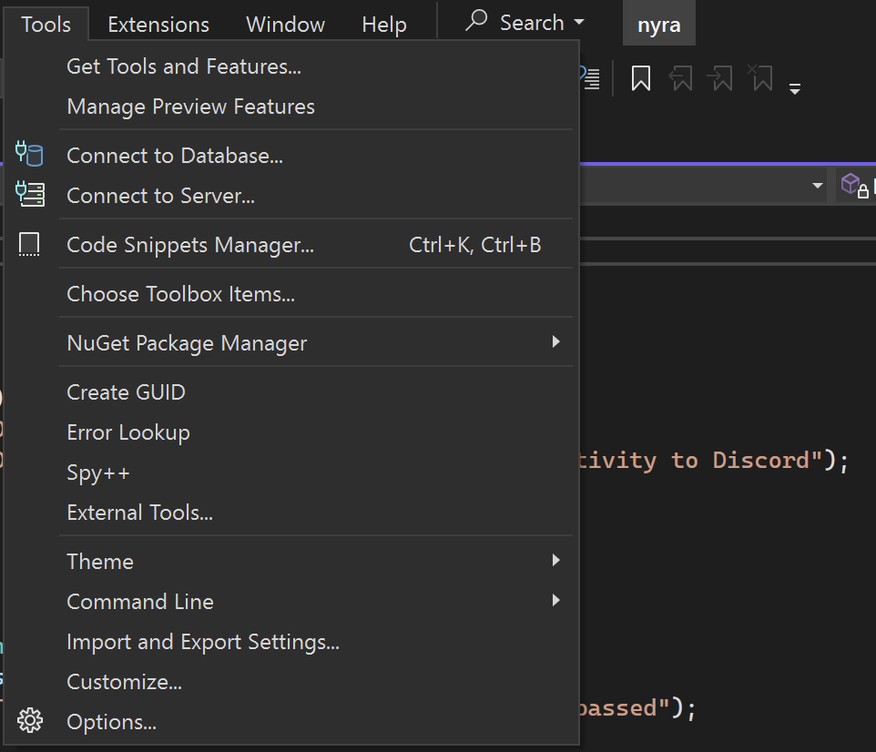
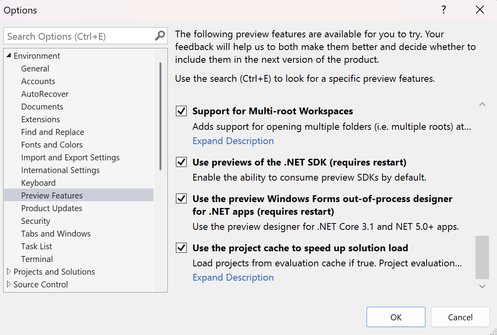

= Building Nyra for Windows in Visual Studio

== Repository
Clone the link:../../[Nyra GitLab] repository.

== Dependencies

Before building, install the following:

* link:https://visualstudio.microsoft.com/downloads/[Visual Studio]
* link:https://dotnet.microsoft.com/en-us/download/visual-studio-sdks?cid=getdotnetsdk[.NET 10.0 Visual Studio SDK]
* link:https://dotnet.microsoft.com/en-us/download/dotnet-framework/thank-you/net481-developer-pack-offline-installer[.NET Framework 4.8.1 Developer Pack]

=== Enable SDK Previews in Visual Studio

. Open **Visual Studio 2022** (or newer)
. Go to `Tools` > `Options`
+

. Expand `Environment` > `Preview Features`
. Enable **"Use previews of the .NET SDK"**
. Click **OK** and restart Visual Studio
+

== Configure

Nyra requires a configuration file before it can run.  
Copy the provided `.env.example` and fill in your details (Discord bot token, prefix, etc.):

[source,shell]
----
cp .env.example .env
----

== Build

After restarting Visual Studio:

. Open the solution file: link:../../nyra.slnx[`nyra.slnx`]
. Click the **Run** button in Visual Studio

This will compile and launch Nyra. If everything is set up correctly, the bot should start without issues.

== Troubleshooting

If the build fails, here are some common issues and solutions.

=== Error: "The current .NET SDK does not support targeting .NET 10.0."

This means your SDK version is out of date or the wrong `dotnet` binary is being used.  

* Ensure .NET 10.0 is installed correctly.  
* Check your `PATH` and make sure the .NET 10 binary is prioritized.  

=== Error: "No BOT_PREFIX variable found in the ENV" or "No DISCORD_TOKEN variable found in the ENV"

These errors indicate Nyra cannot find required environment variables.  

Solution: Copy the example configuration file and fill in the required values:
[source,shell]
----
cp .env.example .env
----
